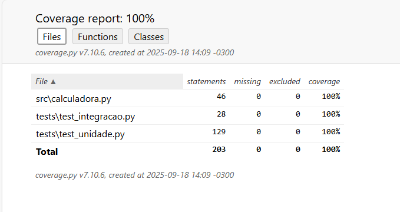

# Relatório dos Testes

### Resultados dos testes
test_integracao_erro_consistencia (test_integracao.TestCalculadora.test_integracao_erro_consistencia) ... ok  
test_integracao_historico_resultado (test_integracao.TestCalculadora.test_integracao_historico_resultado) ... ok  
test_operacoes_sequenciais (test_integracao.TestCalculadora.test_operacoes_sequenciais) 
... ok  
test_consistencia_historico (test_unidade.TestCalculadora.test_consistencia_historico) ...
ok  
test_divisao_por_zero (test_unidade.TestCalculadora.test_divisao_por_zero) ... ok         
test_entrada_saida_divisao (test_unidade.TestCalculadora.test_entrada_saida_divisao) ...
ok  
test_entrada_saida_multiplicacao (test_unidade.TestCalculadora.test_entrada_saida_multiplicacao) ...
ok  
test_entrada_saida_soma (test_unidade.TestCalculadora.test_entrada_saida_soma) ...
ok  
test_entrada_saida_subtracao (test_unidade.TestCalculadora.test_entrada_saida_subtracao) ...
ok  
test_fluxos_divisao (test_unidade.TestCalculadora.test_fluxos_divisao) ... ok  
test_inicializacao (test_unidade.TestCalculadora.test_inicializacao) ... ok  
test_limite_inferior (test_unidade.TestCalculadora.test_limite_inferior) ... ok  
test_limite_superior (test_unidade.TestCalculadora.test_limite_superior) ... ok  
test_limpar_historico_idempotente (test_unidade.TestCalculadora.test_limpar_historico_idempotente) ... ok  
test_mensagens_erro (test_unidade.TestCalculadora.test_mensagens_erro) ... ok  
test_modificacao_historico (test_unidade.TestCalculadora.test_modificacao_historico) ... ok  
test_tipagem_invalida (test_unidade.TestCalculadora.test_tipagem_invalida) ... ok  

### Cobertura do código
Houve 100% de cobertura de todos os testes como mostra a análise realizada pelo coverage:
 

### Problemas encontrados e soluções aplicadas
Felizmente o código da calculadora não apresentou nenhum problema mesmo após a realização de todos os testes.

### Lições aprendidas sobre cada tipo de teste
- Testes Unitários

    - Inicialização:
É imprescindível garantir que os atributos da classe começam em um estado previsível (resultado = 0, historico = []). Isso evita efeitos colaterais inesperados.

    - Operações básicas (soma, subtração, multiplicação, divisão, potência):
Confirmar o funcionamento individual de cada método garante que a base da calculadora seja confiável antes de pensar em cenários mais complexos.

    - Validação de tipagem:
É fundamental validar os tipos de entrada (int ou float). Sem isso, operações com string ou None poderiam passar despercebidas e causar erros em tempo de execução.

    - Limites inferior e superior:
Testar números muito pequenos e muito grandes mostrou a importância de considerar limites de precisão numérica em floats.

    - Divisão por zero:
Aprendi que não basta apenas lançar a exceção — é preciso também garantir que o estado interno (resultado e historico) não seja corrompido.

    - Histórico:
Os testes mostraram como o histórico é parte fundamental da consistência da classe. Além de registrar corretamente as operações, ele precisa ser limpo de forma segura e previsível.

- Testes de Integração
    - Operações sequenciais:
Vi que é essencial verificar se os métodos funcionam bem em conjunto, usando o último resultado como entrada para a operação seguinte. Isso simula o uso real da calculadora.

    - Integração entre histórico e resultado:
Testar a consistência entre os registros no histórico e o valor armazenado em resultado foi importante para garantir que a classe não se perde ao longo de várias operações.

    - Erros em fluxo integrado:
Mesmo quando um erro ocorre no meio de uma sequência (ex: divisão por zero), o sistema deve manter o último estado válido, sem poluir o histórico com dados incorretos.

    - Operações mistas (int + float):
A integração de diferentes tipos numéricos mostrou que a calculadora precisa lidar bem com cenários mistos, mantendo coerência no resultado e no histórico.

    - Histórico acumulado:
Garantir que o histórico reflita exatamente todas as operações realizadas, na ordem correta, reforçou a importância de rastreabilidade e transparência no funcionamento da classe.

